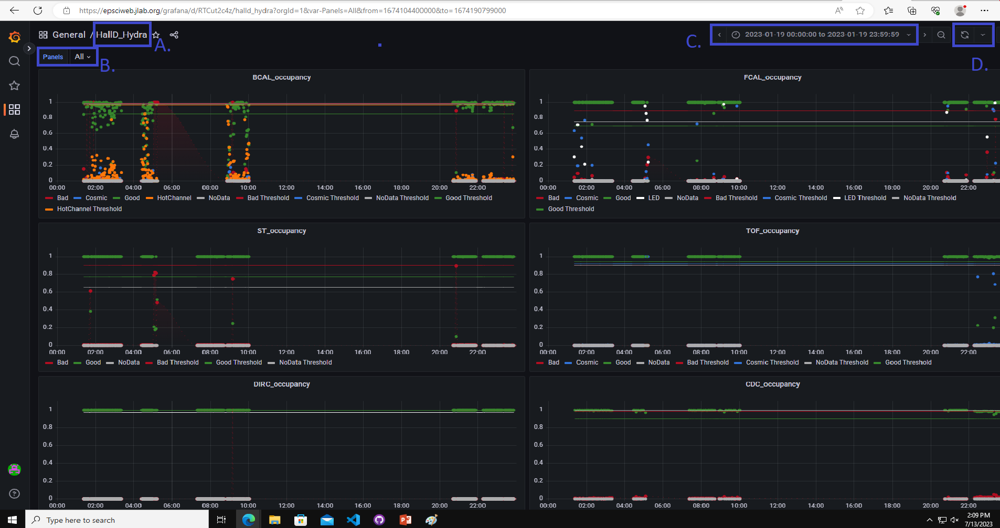
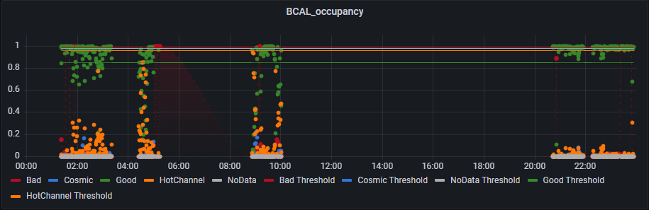

.. _GrafanaFE: 

Grafana
================

This page allows the user to watch as data is taken by the experiment over time. 
It vizualizes data collection over a specified time period, which can be used to indicate noteworthy events like problems or fixes in data collection.

--------------------------------

Navigating the Page 
---------------------

A 
~~~~~~~~~

This is the Experimental hall from which you want to view data. 

B 
~~~~~~~~~~~

This drop-down bar allows the user to filter for a specified model type (i.e. BCAL, FCAL, ST, etc.). 

C 
~~~~~~~~~~~~

This drop-down allows the user to set a specified date or timeframe from which they want to view data. 
In this case, data from the begining to the end of January 19, 2023 is being filtered. 

D 
~~~~~~~~~~~~~~

This drop-down allows the user to refresh the dashboard every specified interval of time.
In this case, no interval has been set. 
A user may decide to intermittently refresh data every if the experiment is actively receiving data. 

-----------------

Reading the Graphs
------------------

This graph shows data collection over a 24 hour period for "BCAL_occupancy" where 
Each dot on a graph is a representation of a plot an how it was classified. 
The x-axis is a specified interval of time, and the y-axis is the confidence of the model's classification for a plot. 

The horizontal colored lines represent threshold values for the different classifications, which are set by the user. 
A key below every graph indicates what each color means. 

