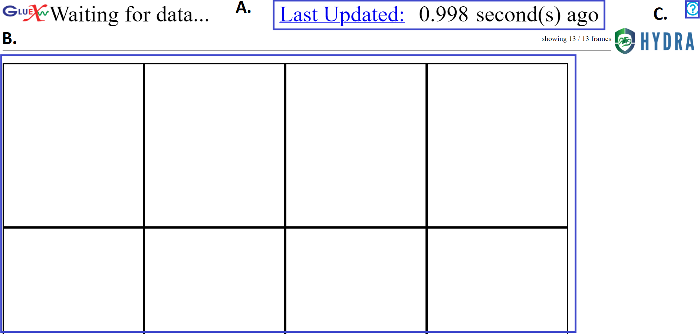
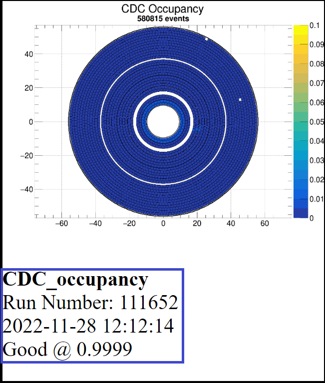

.. _hydraRunFE:

How to use Hydra Run 
=================

This is Hydra's web-based Run page, which displays images as they are loaded in. 
The images contain various identification and classification information, which 

For a more indepth description on the **HydraRun.html** file, see here: :ref:`HydraRunHTML`

A 
~~~~~~~~~

This notifies how many seconds ago since the last image was seen. 
If the text turns red, it could indicate a problem with Hydra or that the data taking has stopped. 
Before any images are seen, the time since the last database poll is given.
Clicking on this will take the user to to a strip-chart view of Hydra sentiments with Grafana. 

B 
~~~~~~~~~~

This is where images will be shown as they are retrieved. 
The images relay identification and classification, which is detailed below in the 'Reading the Images' heading. 

C 
~~~~~~~~~~~~~

More information about the Run page be found after clicking this button. 
It can also be accessed `here<https://halldweb.jlab.org/hydra/HydraRunHelp.html>`. 

Reading the Images 
------------------

This is an example of an image that may be loaded into the grid. 

The bolded section contains various information about the loaded image, including: 

- Title image, which in this case is "CDC_occupancy". 
- Image/graph
- Run Number, which in this case is 111652
- Date and time that the image was taken in the YYYY-MM-DD date format and 24hr format of local time. 
- Classification of the image, which in this case was "Good". 
- (Optinal) Confidence in the classification, which is given to 4 decimal places and represents the value assigned by the model after normalization such that all values across all possible classificatoins is 1. In this case, the confidence of the "Good" label is 0.9999.

There are also various border styles depending on depending on the model or classification status of plots. 
There are are 2 border style variations to be aware of.
**Dotted gray** borders around images represent plots that Hydra knows about, but no model has been deployed for. 
**Solid** borders around images represent plots that Hydra has analyzed. 

The solid border color changes depending on the classification, confidence, and state of the experiment. 
The different colors are: 

- **Black** is the default color, which represents miscellaneous classifications or for when there is no beam. 
- **Light Green** represents "Good" or "Acceptable" classifications. 
- **Orange** represents the "Warning" classifications. An example of this would be an empty occupancy plot, as it is unclear whether the entire detector is off or if the system producing the images is having issues. 
- **Red** represents a "Bad" classificaton. This is an indication of a problem that should be carefully monitored or action should be taken. 

.. note::

    For a better visual representation of these image effects, see `here<https://halldweb.jlab.org/hydra/HydraRunHelp.html>`. 

