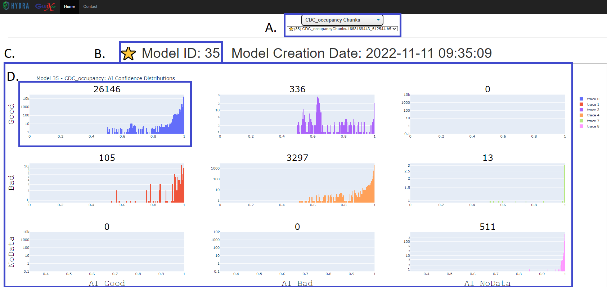
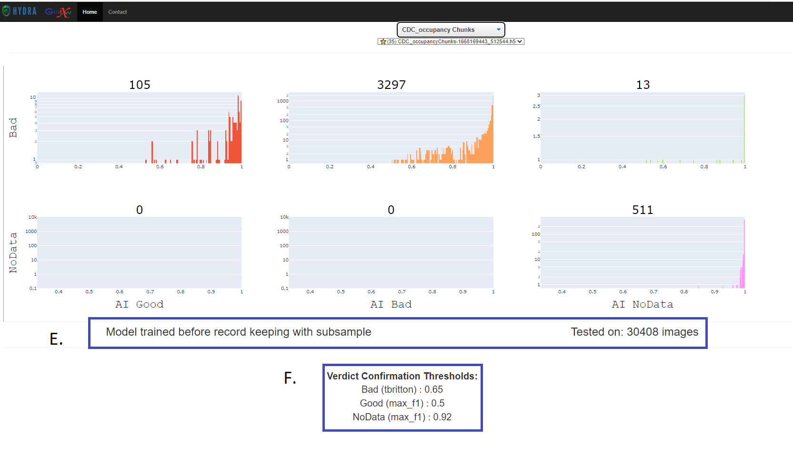

.. _libraryFE: 

How to Use Library
==============

This is Hydra's web-based library, which visually represents the training data of AI models on an array. 
It stores data about all trained models for different JLab experiments and allows verified users to alter threshold values. 

For a more indepth description on the **Library.html** file, see here: :ref:`LibraryHTML`

A 
~~~~~~~~~~~~~~

This drop-down bar allows the user to select which trained AI model to view. 

B
~~~~~~~~~~~~~~

This tells you information about the selected AI model, including: 

- ID number 
- Creation date
- Activity status: The '⭐' before a "Model ID" means that the selected model is actively deployed.
- Data type that the model was trained on: The '🔀' before a "Model ID" means that the selected model was trained on another set of data. For example, if the selected model was 'chunked' and had the '🔀' emoji, the data was trained from unchunked data.  

C 
~~~~~~~~~~~~~

This is the enhanced confusion matrix, which visualizes the agreements and discrepancies in plot labeling by an expert vs the trained AI model. 
The y-axis represents what an expert labeled a plot as, and the x-axis represents what the AI labeled a plot as. 

The cases where the expert agreed with the AI model are seen on the downward-sloped diagonal.

D 
~~~~~~~~~~~~~

Each of the histograms within the grid contains the number of times each case occured, which is seen above the graph.
In this case, there were 26146 instances where the AI model agreed that a plot was 'Good'. 

The graphs also indicate the AI model's confidence in the plot's assigned label, which is seen on the x-axis. 
The y-axis is the number of times the AI model had a specific certainty for its assigned label. 

E
~~~~~~~~~~~~~

This shows additional information about the trained model, like the number of images used to train the AI model. 

F 
~~~~~~~~~~

A user with access can edit these values depending on how confident they want the AI model to be in order to alert the user of a certain plot. 
In this case, user 'tbritton' has set the minumum confidence for a plot the AI labeled 'Bad' to 0.65 in order for it to be verified. 